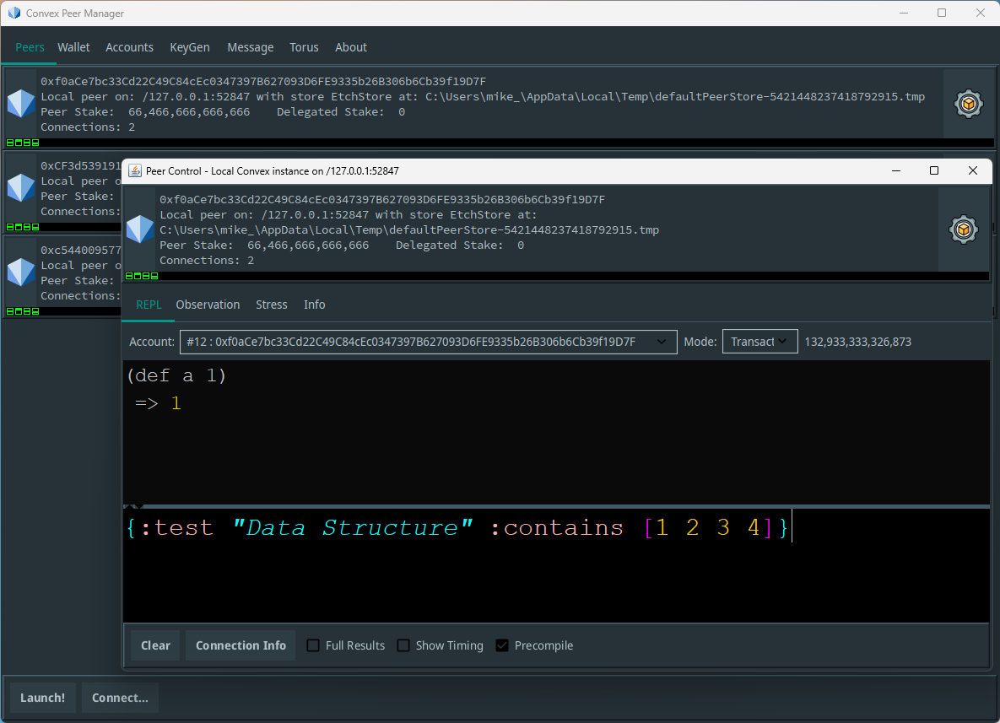

# Convex Desktop GUI

Convex Desktop is a full featured desktop application for working with Convex. It is intended for developers who wish to build solutions on Convex as well as power users who wish to work directly with assets and smart contracts on the Convex Network.

Key features:
- Execute transactions on Convex networks
- Secure key generation and wallet management
- Run a local network of Convex Peers
- Visualisation of CPoS consensus and network messaging
- Simulations and stress test code



```
Unleash the power of the Convex decentralized network directly from your desktop. The Convex GUI 
application puts the control center for Web3 innovation at your fingertips. Designed for power users 
and developers, this intuitive interface empowers you to seamlessly interact with Convex, build 
next-generation dApps, and navigate the future of a democratized internet – all within a familiar
and efficient desktop environment. Take command of your decentralized experience. 
 
Download the Convex GUI today.

- Google Gemini
```

## Usage

### Building

You will need a recent version of Java (21+) and Maven (3.7+) installed

You can then build the latest version of Convex Desktop as follows:

- Download the convex repository via git `https://github.com/Convex-Dev/convex.git` or using the zip download `https://github.com/Convex-Dev/convex/archive/refs/heads/develop.zip`
- Run `mvn install` in the root directory (this will build all Convex modules)
- The Convex `.jar` file should be created at `convex-integration/target/convex.jar` 

### Running Convex Desktop

If Java is properly installed on your machine, you should be able to run the `convex.jar` file directly as a Java application (double click on Windows).

Alternatively, from the command line you can run the desktop with a Java command such as:

```bash
java -jar convex.jar desktop
```

This launches the Convex Desktop application main screen.

## License

Copyright 2019-2024 The Convex Foundation and Contributors

Code in convex-gui is provided under the [Convex Public License](../LICENSE.md). Alternate licenses can be granted for developers in the Convex ecosystem who have specific requirements - contact @mikera to discuss

Feather Icons (https://github.com/feathericons/feather) used under MIT license 

Material UI Swing (https://github.com/vincenzopalazzo/material-ui-swing) used under MIT license.
