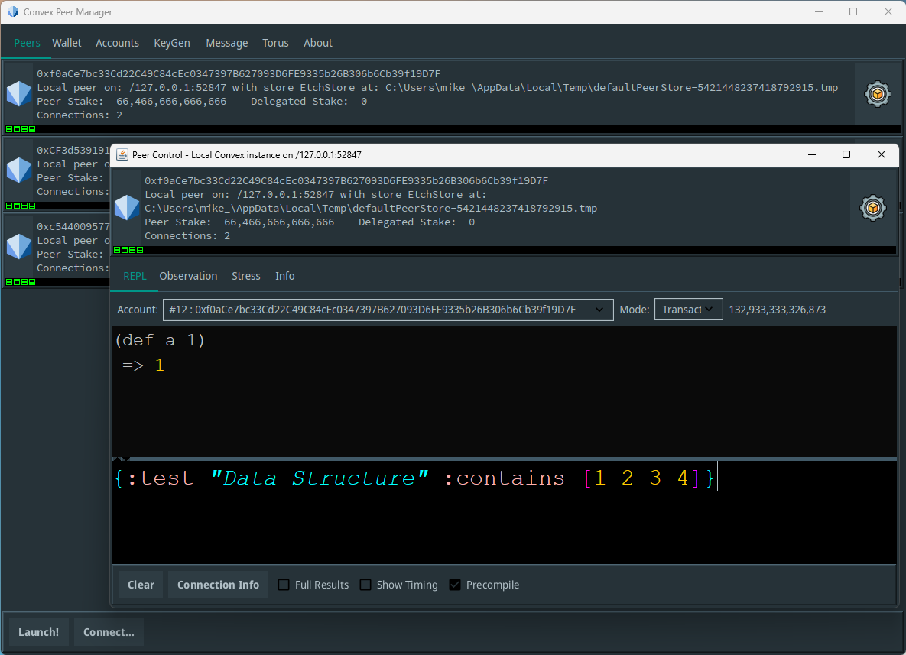

# Convex Desktop

[](https://search.maven.org/search?q=world.convex)

A full-featured desktop application for developers and power users working with the [Convex](https://convex.world) decentralized network.



## Features

- **Transaction Execution** - Submit transactions and queries to Convex networks
- **Wallet Management** - Secure key generation and account management
- **Local Network** - Run a local Convex peer cluster for development
- **Network Visualization** - Real-time view of CPoS consensus and messaging
- **Testing Tools** - Simulations and stress testing capabilities

## Quick Start

### Download

Download `convex.jar` from the [releases page](https://github.com/Convex-Dev/convex/releases).

### Run

```bash
java -jar convex.jar desktop
```

On Windows, you can also double-click `convex.jar` if Java is properly configured.

## Building from Source

**Requirements:** Java 21+, Maven 3.7+

```bash
git clone https://github.com/Convex-Dev/convex.git
cd convex
mvn install
java -jar convex-integration/target/convex.jar desktop
```

## Documentation

- [Convex Documentation](https://docs.convex.world)
- [CLI Reference](../convex-cli/README.md)
- [GitHub Repository](https://github.com/Convex-Dev/convex)

## License

Copyright 2019-2025 The Convex Foundation and Contributors

Code in convex-gui is provided under the [Convex Public License](../LICENSE.md).

### Third-Party Licenses

- [Feather Icons](https://github.com/feathericons/feather) - MIT License
- [Material UI Swing](https://github.com/vincenzopalazzo/material-ui-swing) - MIT License
