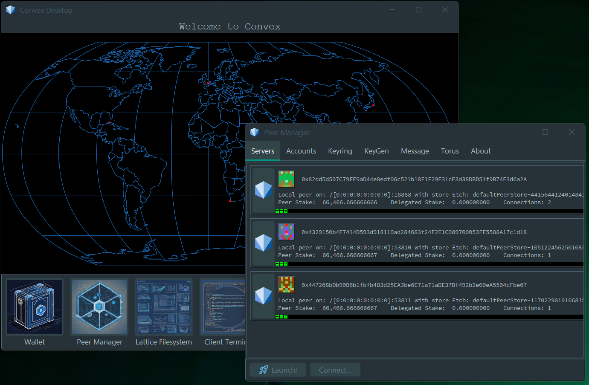

# Convex Desktop GUI

A desktop interface for interacting with Convex



## Overview

Convex Desktop is a full features desktop application for working with Convex. It is intended for developers who wish to build solutions on Convex as well as power users who wish to work direactly with assets and smart contracts on the Convex Network.

Key features:
- Execute transactions on Convex networks
- Secure key generation and wallet management
- Run a local network of Convex Peers
- Visualisation of CPoS consensus and network messaging
- Simulations and stress test code

## Usage

### Local peer operation

Run the main class `convex.gui.manager.PeerGUI`.

This launches the GUI application, which defaults to running a small local network of Peers.

### Flight recorder

```
java -cp target/convex-gui-jar-with-dependencies.jar -XX:+FlightRecorder -XX:StartFlightRecording=duration=200s,filename=flight.jfr convex.gui.manager.PeerGUI
```

## License

Copyright 2019-2024 The Convex Foundation and Contributors

Code in convex-gui is provided under the Convex Public License
